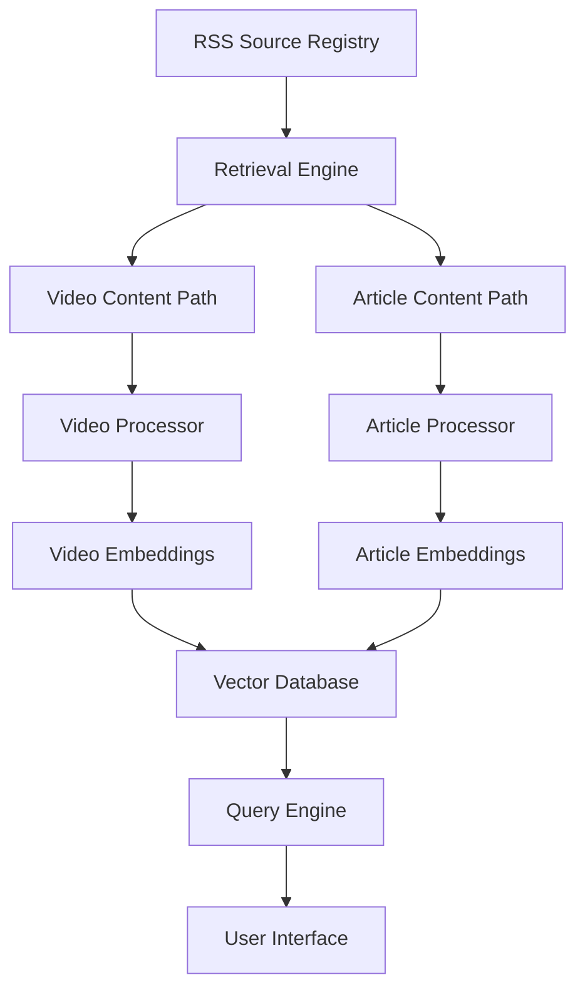

# Lens: Content-Aware Feed Aggregator

## 1. Overview

Lens is a next-generation feed aggregator that uses local AI models to intelligently filter, rank, and recommend content from RSS feeds based on user interests. The system distinguishes between different content types (particularly video vs. article content) and uses specialized processing paths for each, learning user preferences for topics and content formats over time.

## 2. Project Goals

- Create a personalized content discovery system that reduces information overload
- Leverage local AI models (via Ollama) to maintain privacy and control
- Support different content types with specialized processing paths
- Enable natural language queries for content discovery
- Learn from user behavior to improve recommendations over time
- Implement as a command-line tool with Deno runtime

## 3. System Architecture

### 3.1 High-Level Architecture



### 3.2 Core Components

#### RSS Source Registry
- Maintains catalog of RSS feed sources with metadata
- Tags sources by content type (video, article, mixed)
- Tracks source reliability and update frequency
- Stores user preferences per source

#### Retrieval Engine
- Handles feed fetching operations for all content types
- Normalizes basic metadata (publish date, title, author)
- Identifies content type and routes accordingly
- Maintains fetch history and update schedule

#### Content Type Paths
- **Video Content Path**:
  - Specialized for YouTube RSS and other video sources
  - Extracts video metadata (duration, views, engagement metrics)
  - Retrieves transcripts when available
  - Creates video-optimized embeddings

- **Article Content Path**:
  - Optimized for text-based content processing
  - Extracts full or partial article text
  - Performs text analysis (readability, topic modeling)
  - Creates text-optimized embeddings

#### Model Context Protocol Server
- Interfaces with Ollama for various LLM operations
- Handles embedding generation
- Processes content for relevance assessment
- Executes natural language query understanding
- Maintains standardized API for AI operations

#### Vector Database
- Stores content metadata and embeddings
- Supports semantic search capabilities
- Tracks user interaction history
- Maintains temporal data for time-based queries

#### Query Engine
- Translates natural language queries to database operations
- Combines semantic relevance with other ranking factors
- Supports complex queries like "what came in this week that I need to read"
- Applies content type preferences based on topics

#### User Interface (CLI)
- Command-line interface for user interaction
- Supports both structured commands and natural language queries
- Provides feedback mechanisms for model improvement
- Displays content with type-appropriate metadata

## 4. Data Model

### 4.1 Feed Source

```typescript
interface FeedSource {
  id: string;
  url: string;
  title: string;
  contentType: 'video' | 'article' | 'mixed';
  updateFrequency: number; // minutes
  lastFetched: number; // timestamp
  reliability: number; // 0-1 score
  userPreference: number; // user-assigned weight
}
```

### 4.2 Content Item

```typescript
interface ContentItem {
  id: string;
  sourceId: string;
  guid: string;
  title: string;
  description: string;
  contentType: 'video' | 'article';
  url: string;
  publishDate: number; // timestamp
  fetchDate: number; // timestamp

  // Content-specific fields
  videoMetadata?: {
    duration: number;
    views?: number;
    channel: string;
    thumbnail: string;
    transcript?: string;
  };

  articleMetadata?: {
    wordCount: number;
    readingTime: number;
    author?: string;
    fullText?: string;
  };

  // AI-generated fields
  topics: string[];
  embedding: number[];
  relevanceScore: number;
  userInteraction?: {
    read: boolean;
    readDate?: number;
    explicit_feedback?: number; // -1 to 1
  };
}
```

### 4.3 Topic Preference

```typescript
interface TopicPreference {
  topic: string;
  videoPreference: number; // 0-1
  articlePreference: number; // 0-1
}
```

## 5. Key Processes

### 5.1 Content Retrieval & Processing

1. **Scheduled Retrieval**:
   - System checks for feed updates based on update frequency
   - Fetches XML from RSS endpoints
   - Parses feed data and extracts new items

2. **Content Type Detection**:
   - Identifies content type based on source and content examination
   - Routes to appropriate processing path

3. **Video Processing**:
   - Extracts video metadata (duration, channel, etc.)
   - Attempts to retrieve transcript if available
   - Generates embeddings based on available text content
   - Calculates initial relevance score

4. **Article Processing**:
   - Extracts article text (full or summary)
   - Analyzes content structure and readability
   - Generates embeddings based on text content
   - Calculates initial relevance score

5. **Storage**:
   - Saves processed items to vector database
   - Updates indices for efficient retrieval

### 5.2 Content Recommendation

1. **Topic Extraction**:
   - Identifies main topics in content
   - Maps to user's known topic interests
   - Applies topic-based content type preferences

2. **Relevance Scoring**:
   - Combines multiple factors:
     - Topic alignment with user interests
     - Content quality indicators
     - Source authority/reliability
     - Recency and timeliness
     - Content type preference for topic
     - Similarity to previously engaged content

3. **Result Ranking**:
   - Orders content based on final relevance score
   - Groups or separates by content type based on user preference
   - Applies diversity mechanisms to avoid topic monotony

### 5.3 User Interaction

1. **Query Processing**:
   - Parses natural language queries
   - Identifies time constraints, topics, and content type preferences
   - Translates to vector database query

2. **Content Presentation**:
   - Displays ranked items with relevance explanation
   - Includes content-type specific metadata
   - Offers quick actions (read, save, skip)

3. **Feedback Collection**:
   - Tracks what user chooses to consume
   - Records completion status (partially read, fully watched)
   - Accepts explicit feedback when provided

4. **Preference Learning**:
   - Updates topic models based on engagement
   - Refines content type preferences for topics
   - Adjusts source weights based on user interaction

## 6. Implementation Plan

### 6.1 Technology Stack

- **Runtime**: Deno
- **Database**: SQLite with vector extensions or embedded Qdrant
- **AI Models**: Ollama with appropriate local models
- **Feed Parsing**: Standard RSS/Atom libraries
- **CLI Interface**: Cliffy or similar Deno CLI framework

### 6.2 Development Phases

#### Phase 1: Core Infrastructure
- Implement feed fetching and basic parsing
- Set up database schema
- Create content type detection
- Build basic CLI interface

#### Phase 2: AI Integration
- Set up Ollama connection
- Implement embedding generation
- Create basic relevance scoring
- Develop topic extraction

#### Phase 3: Content Type Specialization
- Implement video-specific processing
- Implement article-specific processing
- Create topic preference system
- Develop specialized presentation for content types

#### Phase 4: Query Engine
- Implement natural language query parsing
- Create temporal filtering (this week, today, etc.)
- Develop combined ranking algorithm
- Build feedback collection system

#### Phase 5: Learning & Optimization
- Implement preference learning
- Create user interaction tracking
- Develop automated topic mapping
- Build system performance analytics

## 7. Interface Design

### 7.1 Command Structure

```
# Configuration Commands
add <url> [--type=video|article|mixed]    # Add new feed source
remove <source-id>                        # Remove feed source
configure topics                           # Manage topic preferences

# Content Retrieval Commands
fetch                                      # Update all feeds
fetch <source-id>                          # Update specific feed

# Content Discovery Commands
list [--limit=10]                          # Show top recommended content
videos [--topic=<topic>]                   # List video content only
articles [--topic=<topic>]                 # List article content only
topic <topic>                              # List content for specific topic
recent [--days=7]                          # Show recent content

# Content Interaction Commands
read <id>                                  # View content details
open <id>                                  # Open in browser
feedback <id> [--score=1|-1]               # Provide explicit feedback

# Natural Language Interface
query "what tech videos came in this week" # Natural language query
```

### 7.2 Natural Language Query Examples

- "Show me videos about Deno from this week"
- "What should I read about AI today?"
- "Find interesting programming tutorials"
- "What came in yesterday about web development?"
- "Show me short videos about TypeScript"

## 8. Ollama Integration

### 8.1 Required Models

- Embedding model for vectorization (e.g., nomic-embed-text)
- General purpose LLM for content analysis (e.g., llama2 or mistral)
- Optional specialized models for specific tasks

### 8.2 System Prompts

#### Content Analysis Prompt
```
You are a specialized content analyzer. Evaluate this [content_type] based on the following information:

Title: {title}
Description: {description}
[Content-specific metadata]

1. Identify the main topics covered (comma-separated)
2. Assess if this aligns with the user's interest in: {user_interests}
3. Consider if the content format is appropriate for the topic
4. Rate relevance on a scale of 0-10
5. Provide a brief rationale (max 20 words)
```

#### Query Understanding Prompt
```
You are a content discovery assistant. Parse this user query:

"{user_query}"

Extract the following information:
1. Time frame (e.g., today, this week, recent)
2. Topics of interest
3. Content type preference (video, article, or both)
4. Any specific sources mentioned
5. Any qualifiers (short, detailed, beginner, advanced)
```

## 9. Initial Milestones

1. **Proof of Concept (2 weeks)**
   - Basic feed fetching
   - Simple content storage
   - Content type detection
   - Command-line listing

2. **AI Integration (2 weeks)**
   - Ollama connection
   - Basic embedding generation
   - Simple relevance scoring
   - Topic extraction

3. **Content Type Paths (2 weeks)**
   - Video metadata extraction
   - Article text processing
   - Specialized relevance models
   - Type-based presentation

4. **Query Engine (2 weeks)**
   - Natural language query parsing
   - Semantic search implementation
   - Temporal filtering
   - Combined ranking algorithm

5. **User Learning (2 weeks)**
   - Interaction tracking
   - Preference updating
   - Topic model refinement
   - System performance optimization

## 10. Future Enhancements

- Web interface for easier visualization
- Social sharing and recommendation features
- Content summarization for quick scanning
- Enhanced transcript retrieval for videos
- Full-text extraction for paywalled articles
- Cross-referencing between content items
- Content clustering for topic exploration
- Export/import of user preferences
- Multi-user support with shared collections