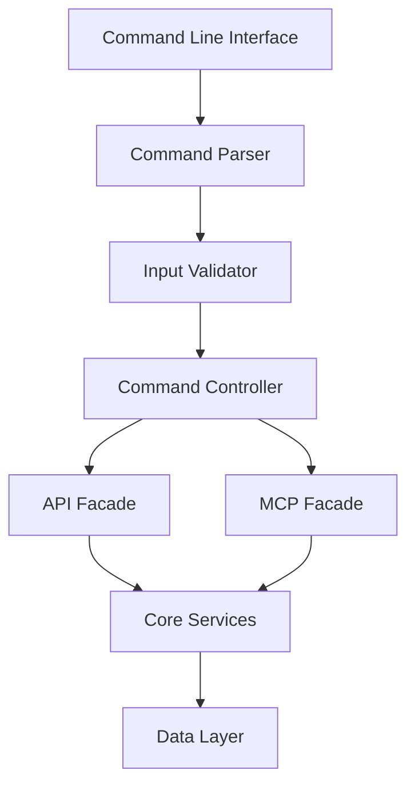
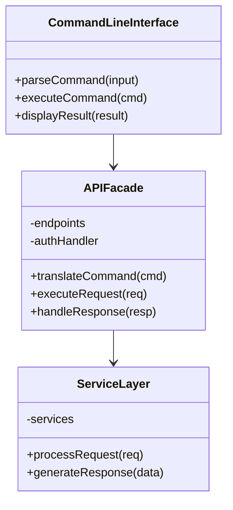
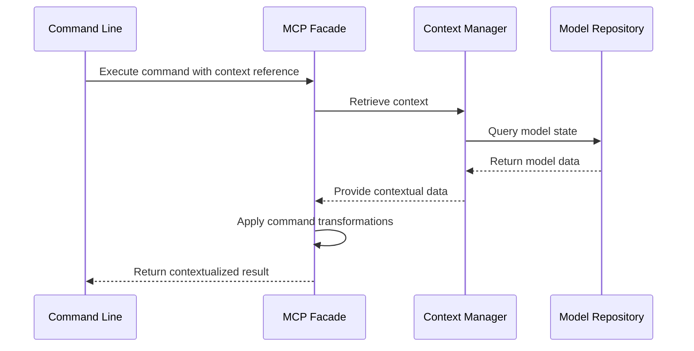
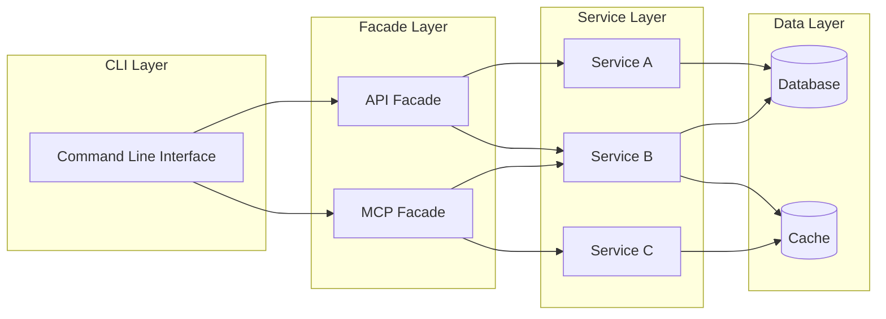
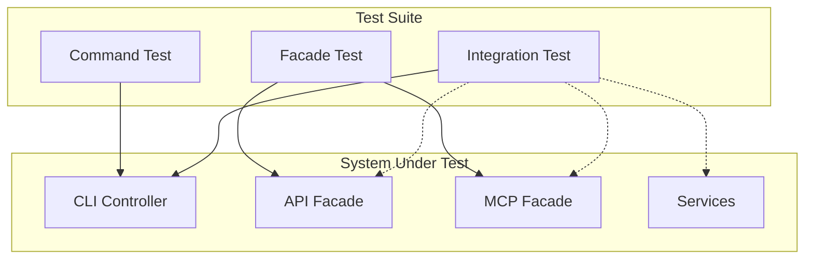
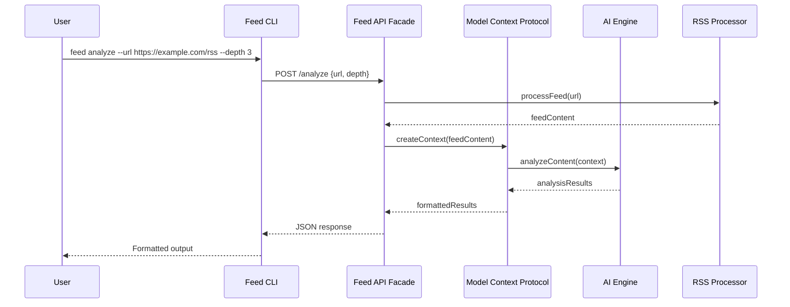
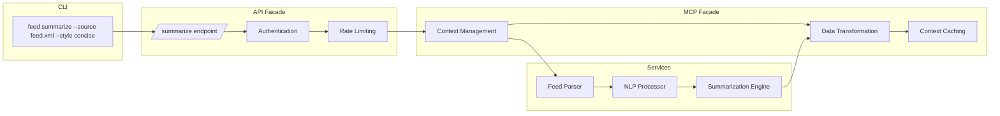

# Command-Line First Architecture with API and MCP Facades

## Introduction

In systems architecture, the approach of beginning with a command-line interface (CLI) before developing more complex interfaces represents a disciplined methodology rooted in fundamental computer science principles. This document examines the architectural pattern wherein a CLI serves as the primary interface, with API and Model Context Protocol (MCP) implementations functioning as facades for underlying services.

## Architectural Overview

The architecture follows a layered approach where the command-line interface provides the initial entry point, with subsequent layers of abstraction handling the transformation and routing of commands through APIs and the Model Context Protocol.

## Command-Line First Methodology

The command-line first approach prioritizes the development of a robust CLI before other interfaces. This methodology offers several advantages in the context of modern software engineering practices.

### Core Principles

1. **Command-Data Separation**: Commands represent intentions (verbs) while data represents the entities (nouns) upon which commands operate.

2. **Compositional Design**: Complex operations are composed from simpler, atomic commands.

3. **Stateless Operation**: Each command execution is designed to be idempotent and independent.

4. **Progressive Disclosure**: The interface reveals increasing complexity as users become more proficient.

## Facades: API and MCP

In this architecture, both the API and Model Context Protocol implementations serve as facades—a structural design pattern that provides simplified interfaces to complex subsystems.

### API Facade

The API facade encapsulates the complexity of service interactions behind a coherent interface that maps CLI commands to appropriate service calls.

### MCP Facade

The Model Context Protocol facade mediates between the CLI and the underlying model context, providing a standardized interface for exchanging structured data.

## Component Isolation

The command-line first approach with facade patterns promotes strict isolation between components through several mechanisms:

1. **Interface Segregation**: Components interact only through well-defined interfaces, not through implementation details.

2. **Dependency Inversion**: High-level modules depend on abstractions, not concrete implementations.

3. **Message Passing**: Components communicate through structured messages rather than shared state.

## Test-Driven Design Advantages

The command-line first architecture inherently supports test-driven development practices through several key features:

1. **Command Atomicity**: Each command performs a single, well-defined operation that can be tested in isolation.

2. **Mock Interfaces**: Facades provide natural boundaries for introducing test doubles.

3. **Scriptability**: CLI commands can be composed into test scripts that verify system behavior.

4. **Reproducibility**: Command sequences can be recorded and replayed for debugging and regression testing.

## Practical Examples

### Example 1: RSS Feed Processing System

Consider an RSS feed processing system that combines AI capabilities with feed management:

In this example, the command-line interface accepts a simple command to analyze an RSS feed. The command is translated by the API facade into appropriate service calls, while the MCP facade manages the context for AI processing. This separation allows for independent testing of each component.

### Example 2: Content Summarization Pipeline

In this pipeline, a command to summarize feed content flows through distinct layers, each with a specific responsibility. The API facade handles HTTP concerns, the MCP facade manages context transformation, and the services perform the actual work.

## Conclusion

The command-line first architecture with API and MCP facades represents a principled approach to systems design that prioritizes simplicity, testability, and component isolation. By starting with a CLI and building facades for more complex interfaces, developers can establish a solid foundation for growing systems while maintaining architectural integrity.

This approach is particularly well-suited for systems that combine AI capabilities with data processing, as it provides clear boundaries between user interaction, data transformation, and model execution contexts.

By adhering to these architectural principles, systems can evolve organically while preserving the ability to test components in isolation, refactor implementation details without disrupting interfaces, and extend functionality through composition rather than modification.
