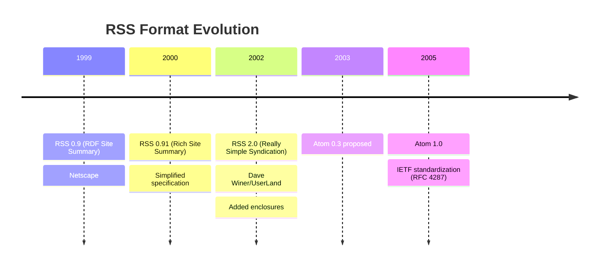
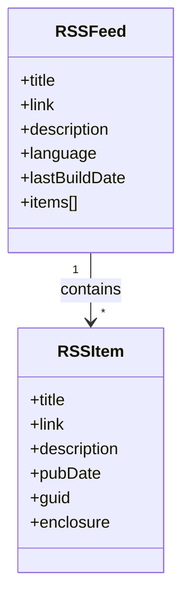
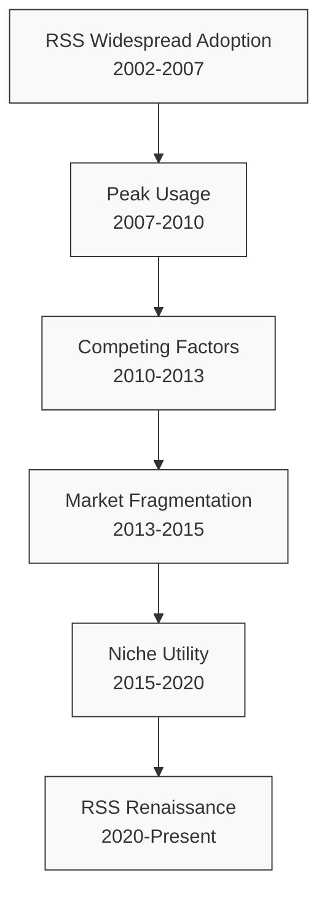

# RSS: Past, Present, and AI-Enhanced Future

## Historical Development

Really Simple Syndication (RSS) emerged in the late 1990s as a response to the proliferation of regularly updated content on the early web. The technology's lineage traces back to multiple concurrent development efforts:

### Origins and Evolution

1. **RDF Site Summary (RSS 0.9)** - Developed by Netscape in 1999 for the My Netscape portal, RSS began as a format based on the Resource Description Framework (RDF).

2. **Rich Site Summary (RSS 0.91)** - Simplified by Netscape to remove RDF elements, making it more accessible to publishers.

3. **Really Simple Syndication (RSS 2.0)** - Dave Winer's UserLand Software took over development in 2000, culminating in the RSS 2.0 specification in 2002. This version introduced enclosures, which later became fundamental to podcast distribution.

4. **Atom** - Developed as an alternative in 2003, the Atom Syndication Format addressed technical limitations in RSS and was published as an IETF standard (RFC 4287) in 2005.

### Technical Foundation

The core premise of RSS is elegantly simple: it provides a standardized XML format for websites to publish updates in a machine-readable form. An RSS document (often called a "feed") contains metadata about the content and a list of items, each typically including:

- Title
- Description or summary
- Publication date
- Link to the full content
- Optional enclosures (for multimedia content)

## The Golden Age of RSS

From roughly 2005 to 2013, RSS experienced widespread adoption across the web ecosystem:

### Key Developments

1. **Browser Integration** - Major browsers implemented RSS detection and subscription features.

2. **Feed Readers** - Dedicated applications for consuming RSS content proliferated, with Google Reader (2005-2013) emerging as the dominant platform.

3. **Content Ecosystem** - Publishers widely adopted RSS as a standard feature of blogs, news sites, and podcasts.

4. **Business Models** - RSS enabled new forms of content monetization through feed advertising and premium subscriptions.

### Decline Factors

Several factors contributed to the perceived decline in RSS prominence:

1. **Centralized Platforms** - The rise of social media platforms like Facebook and Twitter as content discovery mechanisms reduced the perceived need for RSS.

2. **Google Reader Shutdown** - Google's 2013 decision to discontinue its popular Reader service fragmented the RSS user base.

3. **Mobile Shift** - The transition to mobile-first internet usage favored dedicated apps over feed readers.

4. **Publisher Resistance** - Some publishers began offering truncated RSS feeds to drive traffic to their websites rather than allowing full content consumption in readers.

## Contemporary Relevance

Despite its lower profile, RSS has maintained significant relevance and has experienced a renaissance in recent years:

### Persistent Advantages

1. **User Control** - RSS provides users direct control over their information streams, unlike algorithm-curated feeds.

2. **Vendor Independence** - As a decentralized, open standard, RSS is not controlled by any single entity.

3. **Privacy** - RSS readers typically don't track reading habits or manipulate feeds for engagement.

4. **Content Completeness** - RSS can provide full content access without the distractions of web interfaces.

### Modern Use Cases

1. **Professional Research** - Journalists, researchers, and analysts use RSS to monitor sources efficiently.

2. **Technical Documentation** - Software repositories, documentation sites, and technical forums provide RSS feeds for updates.

3. **Specialized Content** - Academic journals, niche publications, and government resources offer RSS feeds for timely updates.

4. **Workflow Automation** - RSS serves as input for IFTTT, Zapier, and custom automation workflows.

## AI Enhancement of RSS

The integration of artificial intelligence with RSS creates powerful opportunities to address information overload while preserving the user-centric advantages of the format:

### AI Capabilities for RSS Processing

1. **Content Summarization** - Automatically generating concise summaries of articles while preserving key information.

2. **Entity Recognition** - Identifying and categorizing people, organizations, locations, and concepts within feeds.

3. **Topic Clustering** - Grouping related items across multiple feeds to identify trends and reduce redundancy.

4. **Sentiment Analysis** - Evaluating the emotional tone and subjective opinions within content.

5. **Recommendation Filtering** - Identifying content of likely interest while avoiding the biases of engagement-based algorithms.

6. **Language Translation** - Automatically translating feed content from multiple languages.

7. **Content Extraction** - Retrieving full content from partial feeds to enable comprehensive processing.

### Implementation Architectures

1. **Client-Side Processing** - AI capabilities embedded in RSS readers process content locally, preserving privacy.

2. **Server-Side Processing** - Cloud-based services enrich RSS feeds before delivery to end-user applications.

3. **Hybrid Approaches** - Local preferences and profiles guide server-side processing for personalized results.

4. **Federated Systems** - Collaborative filtering across users with similar interests while preserving privacy.

## Future Prospects

The combination of RSS with AI technologies positions this established standard for renewed significance in the information ecosystem:

### Emerging Opportunities

1. **Personalized Knowledge Management** - AI-enhanced RSS as the foundation for personal knowledge bases and learning systems.

2. **Semantic RSS** - Enhanced formats incorporating structured data for more sophisticated processing.

3. **Multimodal Content** - Extending RSS principles to handle diverse content types including video, audio, and interactive media.

4. **Decentralized Content Networks** - RSS as infrastructure for resilient content distribution outside centralized platforms.

5. **Research Acceleration** - Domain-specific AI processing of academic and technical feeds to identify breakthrough opportunities.

### Challenges to Address

1. **Standardization** - Developing accepted standards for AI-enhanced feed formats and processing.

2. **Privacy Preservation** - Ensuring user data remains protected while enabling personalization.

3. **Publisher Incentives** - Creating sustainable models that benefit both users and content creators.

4. **Accessibility** - Making sophisticated AI+RSS tools usable for non-technical audiences.

## Conclusion

RSS represents a technology that was ahead of its time, embodying principles of user control, interoperability, and content portability that have become increasingly valuable amid platform centralization and information overload. By enhancing this established standard with modern AI capabilities, we can create information consumption tools that are simultaneously more powerful and more humane.

The future of RSS is not merely as a legacy format but as a foundation for next-generation knowledge management systems that preserve user agency while leveraging AI to make sense of an increasingly complex information landscape. As the volume and complexity of available information continue to grow, the combination of a user-centric distribution format with intelligent processing offers a compelling alternative to the attention economy of contemporary platforms.
