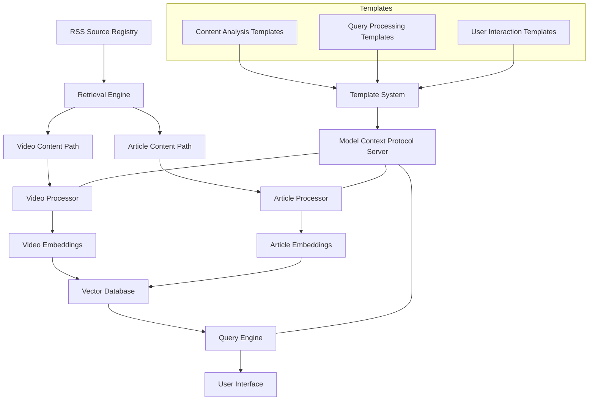
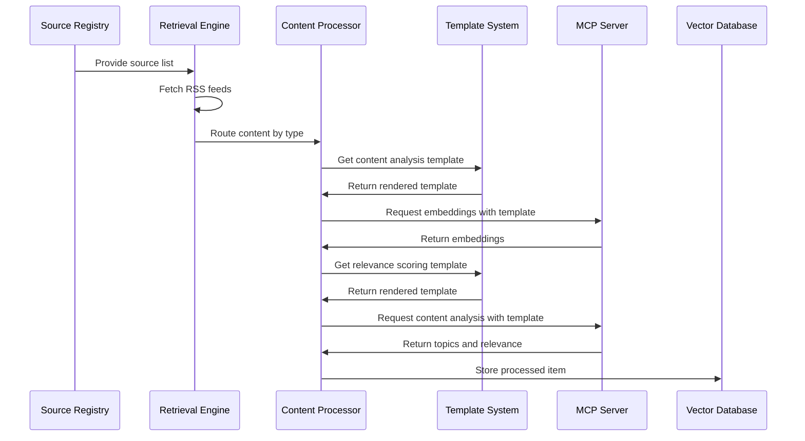
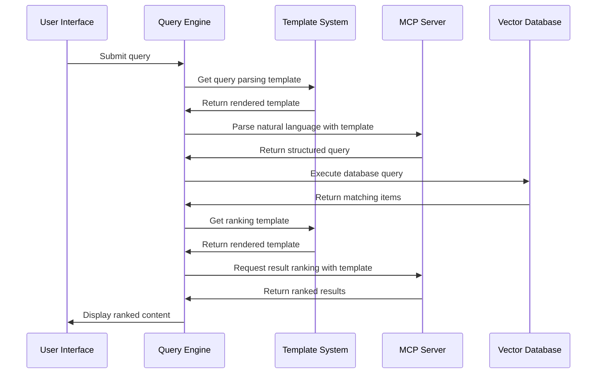
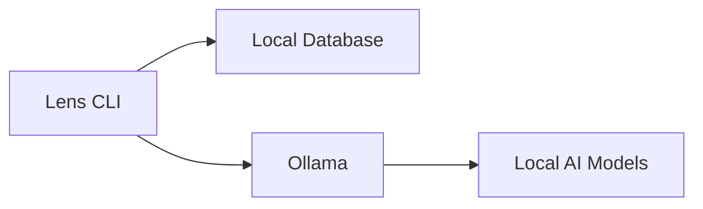
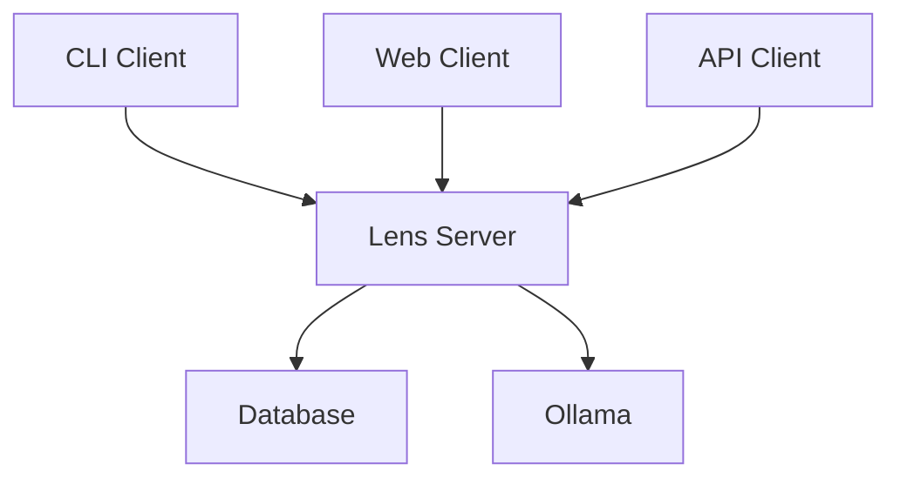

# Lens System Architecture

## 1. Introduction

This document describes the architectural design of the Lens content-aware feed aggregator system. It provides a comprehensive view of the system components, their interactions, and the underlying design principles that guide the implementation.

## 2. Architectural Principles

The Lens architecture adheres to the following principles:

1. **Functional Programming**: The system is built using functional programming principles rather than object-oriented programming for improved clarity, testability, and maintainability.
2. **Component-Based Design**: The system is organized into loosely coupled components with well-defined interfaces.
3. **Separation of Concerns**: Each component has a specific responsibility and minimal knowledge of other components.
4. **Content Type Specialization**: Processing paths are specialized for different content types (video, article).
5. **Local-First Processing**: AI operations run locally to maintain privacy and control.
6. **Extensibility**: The architecture allows for adding new content types and processing capabilities.
7. **Test-Driven Development**: All components have comprehensive test coverage.

## 3. System Architecture Overview

### 3.1 High-Level Architecture

### 3.2 Logical View

The Lens system is organized into the following logical layers:

1. **Data Access Layer**: Handles data storage and retrieval (Vector Database)
2. **Service Layer**: Implements business logic (Processors, Query Engine)
3. **Integration Layer**: Connects to external systems (Retrieval Engine, MCP Server)
4. **Presentation Layer**: Provides user interfaces (CLI, API)

## 4. Component Architecture

### 4.1 RSS Source Registry

**Purpose**: Manages the collection of RSS feed sources and their metadata.

**Key Responsibilities**:
- Store and retrieve feed source information
- Track source reliability and update frequency
- Manage content type tagging for sources
- Store user preferences per source

**Interfaces**:
- `addSource(url, contentType)`: Add a new feed source
- `removeSource(id)`: Remove a feed source
- `getSources()`: Retrieve all sources
- `getSource(id)`: Retrieve a specific source
- `updateSourceMetadata(id, metadata)`: Update source metadata

### 4.2 Retrieval Engine

**Purpose**: Fetches content from RSS feeds and routes it to appropriate processing paths.

**Key Responsibilities**:
- Schedule and execute feed fetching operations
- Parse RSS/Atom feed data
- Detect content type
- Route content to appropriate processing path
- Track fetch history

**Interfaces**:
- `fetchAll()`: Fetch all configured feeds
- `fetchSource(id)`: Fetch a specific source
- `scheduleUpdates()`: Set up automatic update schedule

### 4.3 Content Processing Paths

#### 4.3.1 Video Content Path

**Purpose**: Specialized processing for video content.

**Key Responsibilities**:
- Extract video metadata (duration, views, etc.)
- Retrieve transcripts when available
- Generate video-optimized embeddings
- Calculate initial relevance scores

**Interfaces**:
- `processVideoItem(item)`: Process a video content item
- `extractTranscript(videoUrl)`: Attempt to retrieve video transcript
- `generateVideoEmbeddings(item)`: Create embeddings for video content

#### 4.3.2 Article Content Path

**Purpose**: Specialized processing for article content.

**Key Responsibilities**:
- Extract article text
- Analyze content structure and readability
- Generate text-optimized embeddings
- Calculate initial relevance scores

**Interfaces**:
- `processArticleItem(item)`: Process an article content item
- `extractFullText(articleUrl)`: Attempt to retrieve full article text
- `generateArticleEmbeddings(item)`: Create embeddings for article content

### 4.4 Model Context Protocol Server

**Purpose**: Provides AI capabilities to the system via local models.

**Key Responsibilities**:
- Interface with Ollama for model operations
- Generate embeddings for content items
- Process content for relevance assessment
- Parse natural language queries
- Provide standardized API for AI operations

**Interfaces**:
- `generateEmbeddings(text)`: Create vector embeddings for text
- `analyzeContent(item)`: Extract topics and assess relevance
- `parseQuery(query)`: Parse natural language queries
- `getModelStatus()`: Check availability of required models

### 4.5 Vector Database

**Purpose**: Stores content items and their embeddings for efficient retrieval.

**Key Responsibilities**:
- Store content metadata and embeddings
- Support semantic search capabilities
- Track user interaction history
- Maintain temporal data for time-based queries

**Interfaces**:
- `storeItem(item)`: Save a content item
- `queryItems(params)`: Retrieve items based on query parameters
- `semanticSearch(embedding, limit)`: Find similar content
- `updateUserInteraction(itemId, interaction)`: Record user feedback

### 4.6 Query Engine

**Purpose**: Translates user queries into database operations and ranks results.

**Key Responsibilities**:
- Parse natural language queries
- Combine multiple ranking factors
- Apply content type preferences
- Implement temporal filtering

**Interfaces**:
- `query(naturalLanguageQuery)`: Process a natural language query
- `listRecommended(limit)`: List top recommended content
- `filterByContentType(type, params)`: Filter content by type
- `filterByTopic(topic, params)`: Filter content by topic

### 4.7 Template System

**Purpose**: Manages external markdown templates for all LLM interactions.

**Key Responsibilities**:
- Load and render templates from markdown files
- Process template variables and conditional logic
- Provide standardized format for LLM prompts
- Enable separation of prompt engineering from code

**Interfaces**:
- `loadTemplate(path)`: Load a template from the filesystem
- `renderTemplate(template, variables)`: Render a template with variables
- `callLLMWithTemplate(path, variables, options)`: Process a template and call the LLM

### 4.8 User Interface (CLI)

**Purpose**: Provides command-line interface for user interaction.

**Key Responsibilities**:
- Parse user commands
- Display content with appropriate formatting
- Collect user feedback
- Provide help and documentation

**Interfaces**:
- `executeCommand(command, args)`: Execute a CLI command
- `displayResults(items)`: Show content items to the user
- `collectFeedback(itemId, score)`: Record user feedback

## 5. Data Flow

### 5.1 Content Ingestion Flow

### 5.2 Content Query Flow

## 6. API Architecture

The Lens system provides two primary APIs:

### 6.1 REST API

Provides HTTP endpoints for external applications to interact with the Lens system:

- `/api/sources`: Manage feed sources
- `/api/fetch`: Trigger and schedule content fetching
- `/api/query`: Query content with natural language
- `/api/preferences`: Manage user preferences

### 6.2 Model Context Protocol API

Provides standardized interface for AI model operations:

- `/mcp/embeddings`: Generate vector embeddings
- `/mcp/analyze`: Analyze content and extract topics
- `/mcp/parse`: Parse natural language queries
- `/mcp/status`: Check model availability

## 7. Deployment Architecture

Lens is designed as a local-first application with the following deployment options:

### 7.1 Local CLI Deployment

### 7.2 Server Deployment

## 8. Future Architectural Considerations

- **Web Interface**: Adding a web-based UI for easier visualization
- **Distributed Processing**: Scaling to handle larger content volumes
- **Plugin System**: Supporting extensions for new content types and processors
- **Multi-User Support**: Extending the architecture for shared collections
